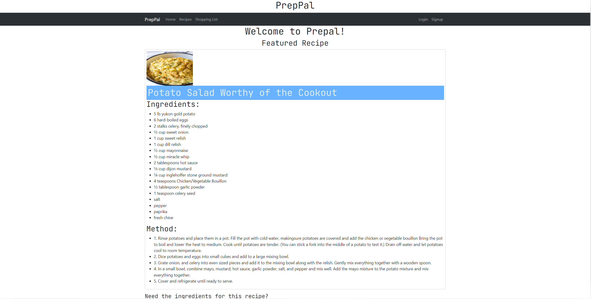

# PrepPal: An Interactive MERN Stack Single-Page Application

## Table of Contents
- [Description](#Description)
- [Installation](#Installation)
- [Usage](#Usage)
- [Contributions](#Contributions)
- [License](#License)
- [Tests](#Tests)
- [Questions](#Questions)

## Description
We set out like to create a platform for users to share and discover recipes, as well as create a grocery list for the recipes they decide to make. Users can explore a variety of recipes, generate shopping lists, and even create meal plans based on their chosen recipes. This project includes user authentication for user sign-up and login, a database consisting of users and recipes, and a UI that allows users to input recipes as well as create their shopping list based on the recipes that have saved. This app is has a React front end and utilizes a GraphQL with a Node.js and Express.js server, as well as MongoDB and Mongoose ODM for the database! 

## Installation
Clone the repo to your local machine, download the dependencies, and seed the database. Alternatively, the app can be accessed via heroku [here](https://stormy-hollows-30226-21c3ccd5e3ee.herokuapp.com/)!

## Usage
Navigate to the site. Sign up or login to utilize the full functionality of the site. Click on the recipes tab to view a list of the site's available recipes or add your own. Navigate to a single recipe by clicking on it. Once on the single recipe page, you may add the ingredients to a shopping list unique to your user. From the shopping list tab, you can review added lists of ingredients and add more items from the form on the page.

## Contributions
N/A

## License
MIT license.
Please refer to https://opensource.org/license/mit/ for more details.

## Tests
N/A

## Questions
Contact us on GitHub:
 
[Delante](https://github.com/delantetr), [Reagan](https://github.com/Reyyahs), and [Monique](https://github.com/mahlheim)! 
